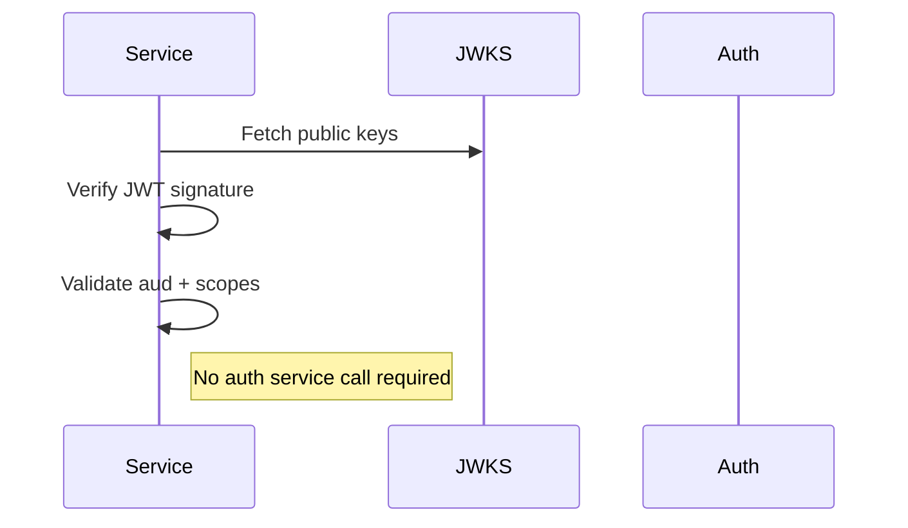

# Authentication Model

Authentication is designed to avoid central bottlenecks.

## Access Tokens

Access tokens are:

- Self-contained JWTs
- Signed with rotating keys
- Verifiable via JWKS
- Audience-bound
- Scope-structured

Verification does not require contacting the auth service.

## Introspection

Introspection exists for:

- Debugging
- Edge-case validation
- Revocation checks

It requires service-level authorization.

## Scope Structure

Scopes are structured objects:

- type
- actions
- resource
- constraints

This enables forward-compatible expansion without schema breaking.

## Audience Enforcement

Tokens include an array of audiences.

Services must verify they are included in `aud`.

This prevents token reuse across unintended services.

## Design Goal

Authentication should:

- Not be a bottleneck.
- Not require runtime dependency for verification.
- Integrate naturally into graph-based architecture.

## JWT Verification Flow

