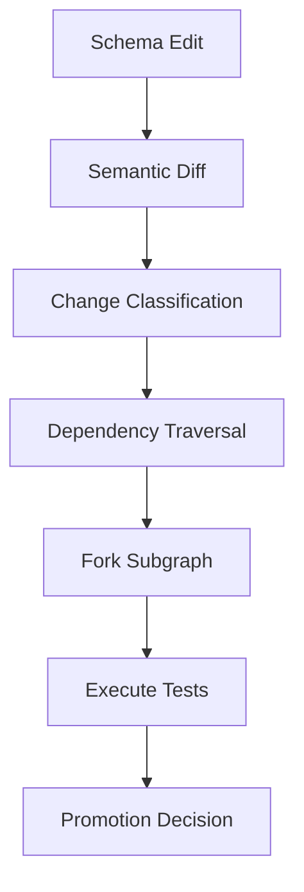

# Contract Model

Contracts are first-class graph artifacts.

## OpenAPI as Truth

Backend services expose OpenAPI specifications.

These specifications define:

- Request schemas
- Response schemas
- Authentication requirements
- Error contracts

Contracts are versioned.

## Contract Mutation

When a contract changes:

- The graph is updated.
- Downstream nodes are evaluated.
- A propagation sequence begins.

## Non-OpenAPI Nodes

Not all nodes expose OpenAPI.

Frontend-only components and internal libraries may not.

However, dependency edges still exist.

Contracts are required only at network boundaries.

## Long-Term Vision

Contracts may eventually:

- Be auto-generated.
- Be machine-validated against implementation.
- Drive automated code transformation.
- Trigger documentation updates.

The contract is the system boundary.

## Contract Mutation Lifecycle

