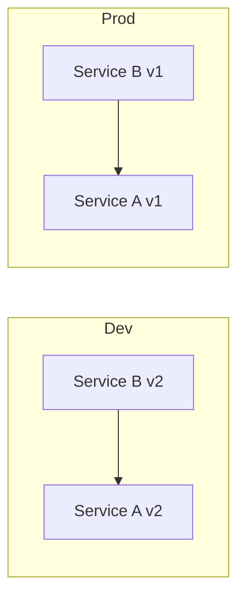
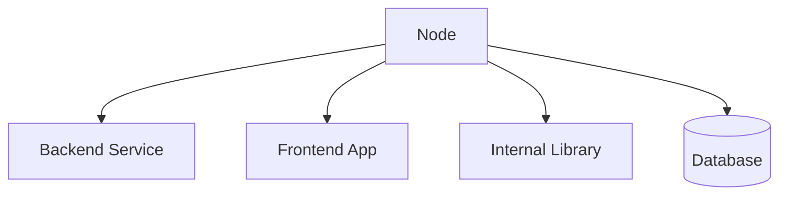

# Mesh Model

The mesh is a live representation of system structure.

Each deployed service instance corresponds to a graph node.

The mesh exists in two forms:

- Dev Mesh (experimental)
- Prod Mesh (stable)

## Dev Mesh

The Dev Mesh is:

- Forkable
- Propagation-enabled
- Test-gated
- Disposable

When a contract changes, a subgraph is forked into Dev Mesh.

Dependent services are updated within this fork.

## Prod Mesh

The Prod Mesh:

- Contains validated nodes
- Is mutation-resistant
- Accepts only promoted graph states

Promotion is atomic at the graph level.

## Mesh as State

The mesh is not just deployment topology.

It represents:

- Service versions
- Contract versions
- Dependency edges
- Validation status

The mesh is architecture encoded as runtime state.

## Dual Mesh Model

## Node Types

