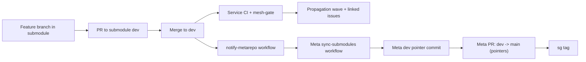

# Architecture Overview

Software Graph combines three layers:

1. Service graph modeling (`sg-mesh.yaml`) for nodes and dependency edges.
2. Contract extraction + diffing for interface-level change detection.
3. Operational workflows (CI, propagation, and pointer sync) that keep repos aligned.

## Node Types

Common node kinds in the mesh include:

- `python-api`
- `react-spa`
- `python-sdk`
- `node-sdk`
- infrastructure dependencies

Not every node exposes OpenAPI, but every node can participate in dependency traversal.

## Edge Semantics

Edges are directional and typed.

If `A -> B`, then `A` consumes `B`.
A change in `B` may require updates in `A`.

Edges can also carry tag-group information, which enables selective propagation when only specific API areas are breaking.

## Branch-Scoped Mesh State

The mesh is represented by the meta-repo branch plus pinned submodule commits:

- On `dev`, pointers should reference each submodule's `dev` line.
- On `main`, pointers should reference each submodule's `main` line.

Submodule pointer updates are event-driven by GitHub Actions and recorded as normal commits in the meta-repo.
The auto-sync lane is `dev`; `main` pointer updates are promoted from meta `dev` via PR.

## Operational Architecture

For concrete command flows, see [Operations / Workflow](/operations/workflow).
