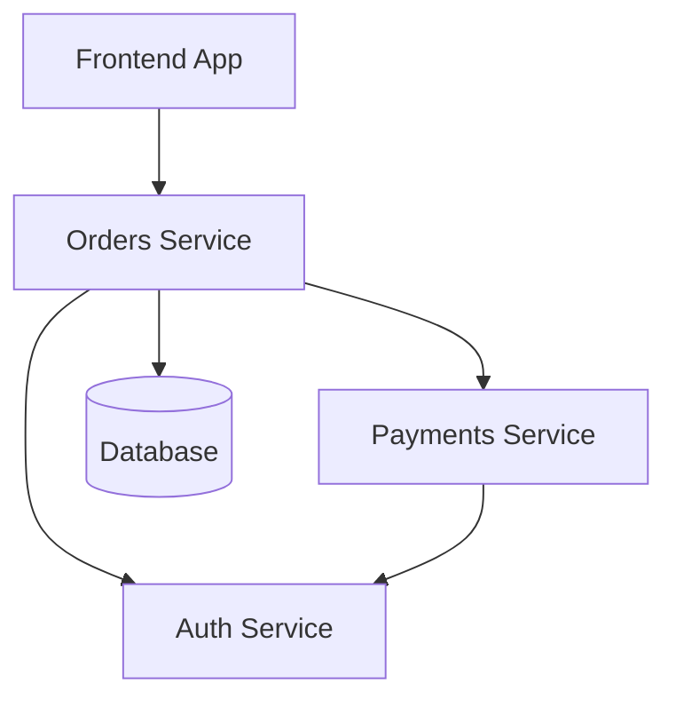

# Architecture Overview

Software Graph models software systems as directed graphs.

Each node represents a service or component.

Each edge represents a dependency.

## Node Types

Nodes may represent:

- Backend services (OpenAPI-based)
- Frontend applications
- Internal libraries
- Data stores
- Auth providers

Not all nodes expose OpenAPI contracts.  
Only network boundaries require formal API contracts.

## Edge Semantics

Edges are directional.

If Service A depends on Service B:

A → B

A consumes B’s contract.

When B changes, A may require modification.

Edges define propagation paths.

## Dual Mesh Model

Two parallel meshes exist:

- Dev Mesh
- Prod Mesh

Changes are introduced into Dev Mesh.

Propagation, validation, and testing occur.

Only validated graphs are promoted to Prod Mesh.

## Deterministic Evolution

Architecture changes follow a deterministic sequence:

1. Contract mutation
2. Dependency traversal
3. Subgraph fork
4. Code adaptation
5. Test execution
6. Coverage validation
7. Promotion decision

Software evolution becomes structured rather than reactive.

## Example Service Graph

