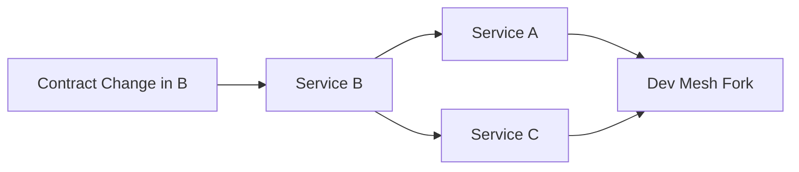
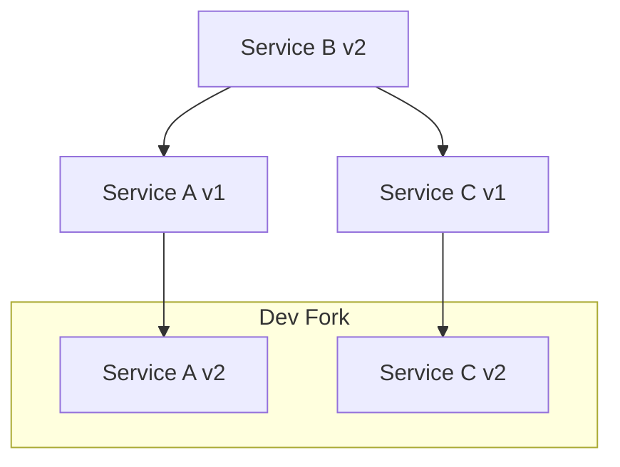

# Propagation Engine

The Propagation Engine computes downstream impact from contract changes.

## Trigger

A propagation begins when:

- An OpenAPI schema changes
- A dependency version updates
- A node interface mutates

## Algorithm (Conceptual)

1. Identify changed node.
2. Traverse outgoing edges.
3. Mark dependent nodes as impacted.
4. Fork impacted subgraph into Dev Mesh.
5. Apply automated code updates (future agent layer).
6. Execute tests.
7. Evaluate coverage thresholds.
8. Decide promotion.

## Guarantees

The system aims to guarantee:

- No silent contract breakage.
- Deterministic update ordering.
- Explicit promotion boundaries.
- Traceable change history.

Propagation is structural, not manual.

## Propagation Flow

## Subgraph Fork

