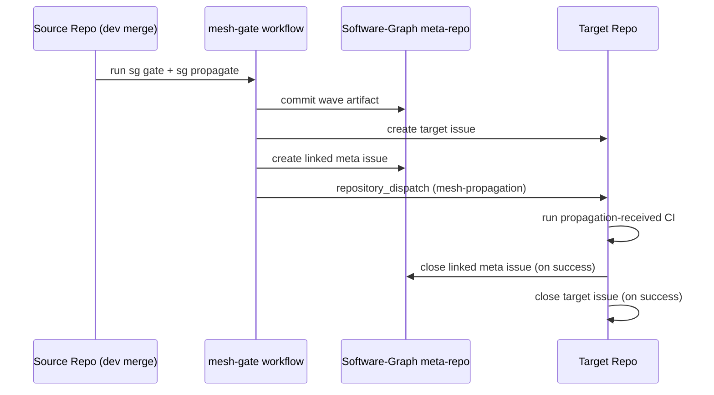

# Propagation Lifecycle

This page describes the implemented issue lifecycle for breaking changes.

## End-to-End Sequence



## Wave Creation

`sg propagate <source>` writes a wave JSON under `propagations/` when breaking impact exists.

Wave includes:

- source service + commit
- target services
- edge/tag metadata
- issue ids/urls after issue creation step

## Linked Issues

For each impacted target:

1. Target repo issue is created for actionable work.
2. Meta-repo issue is created for global visibility.
3. Both are cross-linked.

This gives local ownership in the target repo and centralized tracking in the meta repo.

## Target Repo Handling

Target repos listen for:

- `repository_dispatch` with action `mesh-propagation`

Their CI logs the wave payload, runs checks, and on success closes linked issues (meta + target) using `MESH_TOKEN`.

## Manual Acknowledgement

If needed, an operator can mark target status manually:

```bash
sg propagate-ack <wave_id> <service>
sg propagate-ack <wave_id> <service> --skip
```

Use cases:

- resolver confirms no code change needed
- non-automated fix path
- administrative cleanup

## Noise Control

Propagation is intentionally reduced by:

- filtering docs/CI-only diffs before propagation step
- classifying breaking vs non-breaking contract changes
- selecting only consumers of affected tag groups
