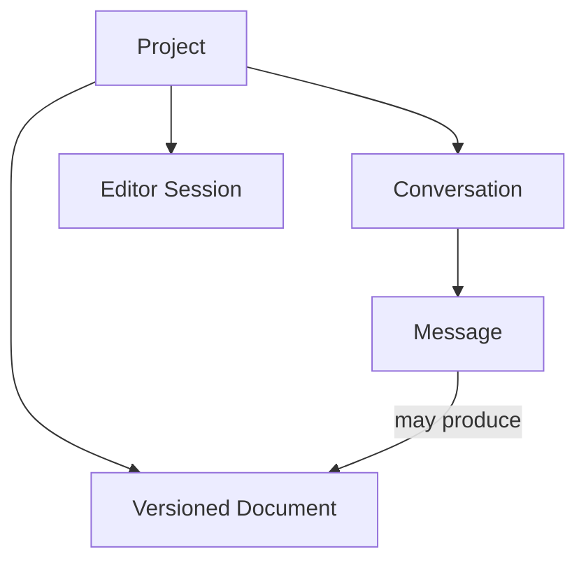
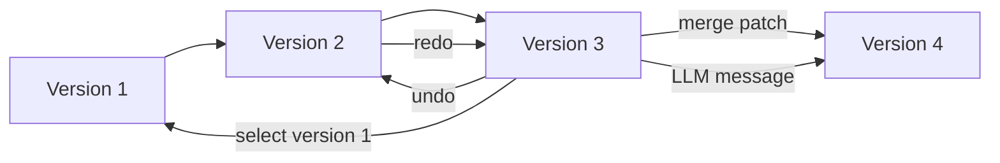
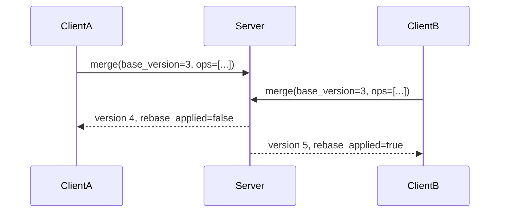

# API Editor Service

The API Editor Service is an LLM-driven collaborative OpenAPI schema creation and editing backend.

Users interact through a chat interface to describe or refine an API. The LLM generates and iterates on a versioned OpenAPI document. Multiple clients can edit simultaneously using an optimistic-concurrency RFC 6902 patch merge model.

---

## Concepts

The service is organized around four core concepts:



| Concept | Description |
|---|---|
| **Project** | Top-level container. Owns one OpenAPI document and any number of conversations. |
| **Document** | A versioned OpenAPI 3.x spec. Every save, LLM edit, or merge creates a new version. Supports undo, redo, and explicit version selection. |
| **Conversation** | An LLM chat thread scoped to a project. Messages can trigger OpenAPI draft generation. |
| **Editor Session** | A client presence lease. Used to track who is actively editing and whether the LLM currently holds the document lock. |

---

## Document Versioning Model



Every mutation produces a new monotonically increasing version number. The history endpoint exposes `can_undo` and `can_redo` flags along with the full version list.

---

## Collaborative Merge

When multiple clients are editing, they submit RFC 6902 patch operations via `/documents/merge`. The server performs an optimistic rebase:

- Client provides `base_version` — the version the edits were authored against.
- If the server is ahead, a rebase is attempted automatically.
- The response includes `rebase_applied`, `conflict_paths`, and the resulting new version.



---

## LLM Lock

When the LLM is generating a document update, the project is locked. The `EditorStatusResponse` exposes `is_locked_for_llm`. Clients should poll or check this before submitting manual edits.

Sending a message with `generate_openapi_draft: true` (the default) will trigger LLM-driven document generation and produce a new version atomically with the assistant reply.

---

## API Reference

### Health

| Method | Path | Description |
|---|---|---|
| `GET` | `/health` | Returns service status. |

---

### Projects

| Method | Path | Description |
|---|---|---|
| `GET` | `/v1/projects` | List all projects. |
| `POST` | `/v1/projects` | Create a project. Optionally seed with an initial OpenAPI document. |
| `GET` | `/v1/projects/{project_id}` | Get project detail including current document version. |
| `PATCH` | `/v1/projects/{project_id}` | Rename a project. |
| `DELETE` | `/v1/projects/{project_id}` | Delete a project. |

**Create project body:**

```json
{
  "name": "My API",
  "description": "Optional description",
  "initial_openapi_document": { ... }
}
```

---

### Documents

All document routes are scoped under `/v1/projects/{project_id}/documents`.

| Method | Path | Description |
|---|---|---|
| `GET` | `.../history` | Full version history with `can_undo` / `can_redo` flags. |
| `PUT` | `.../latest` | Save a full document spec. Requires `base_version` for optimistic concurrency. |
| `POST` | `.../merge` | Submit RFC 6902 patch operations for collaborative merge. |
| `POST` | `.../undo` | Step back one version. |
| `POST` | `.../redo` | Step forward one version. |
| `POST` | `.../select/{version}` | Jump to a specific version. |

**Save document body:**

```json
{
  "base_version": 3,
  "spec": {
    "openapi": "3.1.0",
    "info": { "title": "My API", "version": "1.0.0" },
    "paths": {}
  }
}
```

**Merge patch body:**

```json
{
  "base_version": 3,
  "actor_label": "Alice",
  "operations": [
    { "op": "add", "path": "/paths/~1users", "value": { ... } }
  ]
}
```

---

### Conversations

| Method | Path | Description |
|---|---|---|
| `GET` | `/v1/projects/{project_id}/conversations` | List conversations for a project. |
| `POST` | `/v1/projects/{project_id}/conversations` | Create a conversation. |
| `GET` | `/v1/conversations/{conversation_id}` | Get a conversation. |
| `PATCH` | `/v1/conversations/{conversation_id}` | Rename a conversation. |
| `DELETE` | `/v1/conversations/{conversation_id}` | Delete a conversation. |
| `GET` | `/v1/conversations/{conversation_id}/messages` | List messages (cursor-paginated by `before` timestamp). |
| `POST` | `/v1/conversations/{conversation_id}/messages` | Send a message. Returns both the user and assistant messages, plus a new document version if generated. |

**Send message body:**

```json
{
  "content": "Add a POST /users endpoint that creates a user",
  "generate_openapi_draft": true,
  "expected_document_version": 3
}
```

`expected_document_version` acts as an optimistic guard — the LLM will be told the current version to base its update on.

---

### Collaboration

| Method | Path | Description |
|---|---|---|
| `POST` | `/v1/projects/{project_id}/editor-sessions` | Acquire an editor session lease. |
| `POST` | `.../editor-sessions/{client_id}/heartbeat` | Renew session lease and optionally update `actor_label`. |
| `DELETE` | `.../editor-sessions/{client_id}` | Release a session. |
| `GET` | `/v1/projects/{project_id}/editor-status` | Get active editors and LLM lock status. |

Clients should send heartbeats regularly to stay visible. Sessions expire automatically if heartbeats stop.
