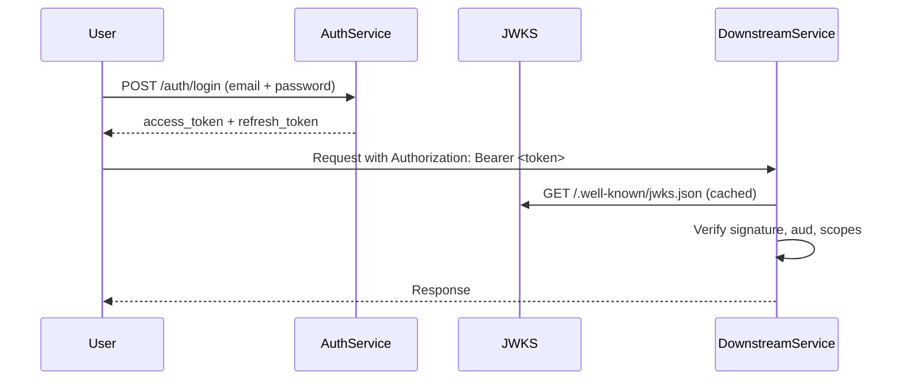
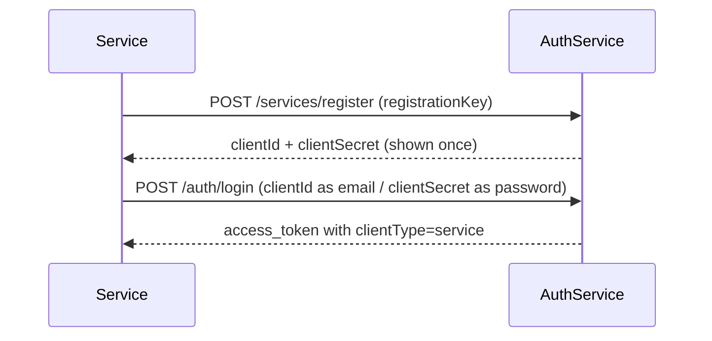

# Auth Service

JB Auth is the backend authentication service for the Software Graph platform. It handles user registration, login, token issuance, and service-to-service identity.

Access tokens are self-contained JWTs verified locally via JWKS — the auth service is never in the hot path of request verification.

---

## Token Flow



Downstream services verify tokens independently. No runtime call to the auth service is required.

---

## Service Identity Flow

Services authenticate using `client_credentials` — a `clientId` and `clientSecret` issued at registration time. Service tokens include a `clientType` claim to distinguish them from user tokens.



---

## Access Token Claims

Tokens are standard JWTs with the following claim set:

| Claim | Type | Description |
|---|---|---|
| `sub` | string | Subject — user UUID or service client ID. |
| `iss` | string | Issuer — identifies this auth service. |
| `aud` | string[] | Audiences — intended recipient services. |
| `exp` | integer | Expiry (Unix timestamp). |
| `iat` | integer | Issued at (Unix timestamp). |
| `jti` | string | Unique token ID for revocation tracking. |
| `scopes` | Scope[] | Structured permission objects. |
| `clientId` | string | Present on service tokens. |
| `clientType` | string | Present on service tokens. |

### Scope Structure

Scopes are structured objects, not flat strings:

```json
{
  "type": "payments",
  "actions": ["read", "write"],
  "resource": "invoice",
  "constraints": {
    "tenantId": "acme-corp"
  }
}
```

This allows forward-compatible permission expansion without breaking existing token consumers.

---

## Verification Guide

Services should verify tokens locally using the JWKS endpoint:

1. Fetch `/.well-known/jwks.json` and cache the public keys (respect standard cache headers).
2. Verify the JWT signature against the matching `kid`.
3. Validate `exp` is in the future.
4. Confirm `aud` contains your service identifier.
5. Evaluate `scopes` for the required permission.

Introspection (`POST /auth/introspect`) is available for debugging and edge-case revocation checks, but **should not be used in the hot path**.

---

## API Reference

### Health

| Method | Path | Description |
|---|---|---|
| `GET` | `/health` | Service health check for monitoring and readiness probes. |

---

### Auth

| Method | Path | Auth | Description |
|---|---|---|---|
| `POST` | `/auth/register` | None | Create a new user account. `inviteCode` required when invite-only mode is enabled. |
| `POST` | `/auth/login` | None | Authenticate and receive `access_token` + `refresh_token`. |
| `POST` | `/auth/refresh` | None | Exchange a refresh token for a new token pair. |
| `POST` | `/auth/introspect` | `serviceBearer` | Validate a token and return its claims. Service-level access only. |

**Register body:**

```json
{
  "email": "user@example.com",
  "password": "min8chars",
  "inviteCode": "optional-if-invite-only"
}
```

**Login body:**

```json
{
  "email": "user@example.com",
  "password": "yourpassword"
}
```

**Login response:**

```json
{
  "access_token": "<jwt>",
  "refresh_token": "<opaque>",
  "token_type": "Bearer",
  "expires_in": 3600
}
```

**Refresh body:**

```json
{
  "refresh_token": "<opaque>"
}
```

**Introspect body** _(service-only)_:

```json
{
  "token": "<jwt>"
}
```

**Introspect response (active):**

```json
{
  "active": true,
  "claims": {
    "sub": "...",
    "aud": ["payments-service"],
    "scopes": [{ "type": "payments", "actions": ["read"] }],
    ...
  }
}
```

**Introspect response (inactive):**

```json
{
  "active": false
}
```

---

### Services

| Method | Path | Auth | Description |
|---|---|---|---|
| `POST` | `/services/register` | None (provisioning key) | Register a new service client. Returns `clientId` and `clientSecret` — secret is shown once. |

**Register service body:**

```json
{
  "name": "payments-service",
  "registrationKey": "<provisioning-secret>",
  "metadata": {}
}
```

**Response:**

```json
{
  "id": "<uuid>",
  "name": "payments-service",
  "clientId": "<client-id>",
  "clientSecret": "<secret — store securely, not shown again>",
  "createdAt": "2026-02-27T00:00:00Z"
}
```

---

### JWKS

| Method | Path | Description |
|---|---|---|
| `GET` | `/.well-known/jwks.json` | Public keys for JWT verification. Cache aggressively. |

---

## Security Notes

- `registrationKey` is a provisioning secret. Treat it like credentials and rotate regularly.
- `clientSecret` is returned only at registration time. Store it securely immediately.
- Introspection requires a valid service-level bearer token (`serviceBearer` security scheme).
- Tokens include `jti` for revocation tracking if needed.
